# MarketVol Airflow Pipeline Validation

This document captures the steps used to build, run, trigger, and validate the **MarketVol Airflow DAG**.  
The screenshots are stored in the `images/` directory and are referenced with relative paths, so they will display correctly in the GitHub UI.

---

## 1. Build the Docker Images

Build all Docker images from scratch to ensure the latest source code and dependency changes are included.

```bash
docker compose build --no-cache
```

**Evidence**

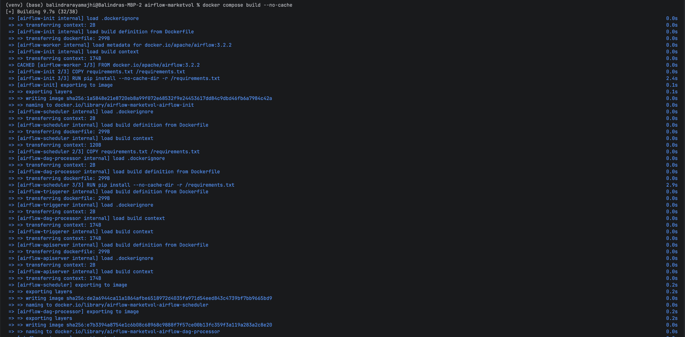

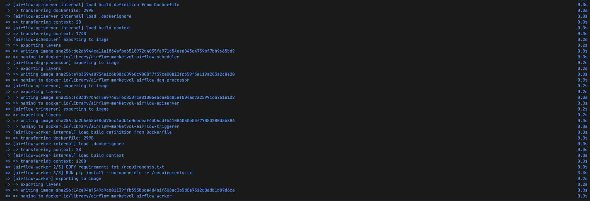

---

## 2. Initialize Airflow

Run the Airflow initialization service. This prepares the Airflow metadata database and required setup.

```bash
docker compose up airflow-init
```

**Evidence**

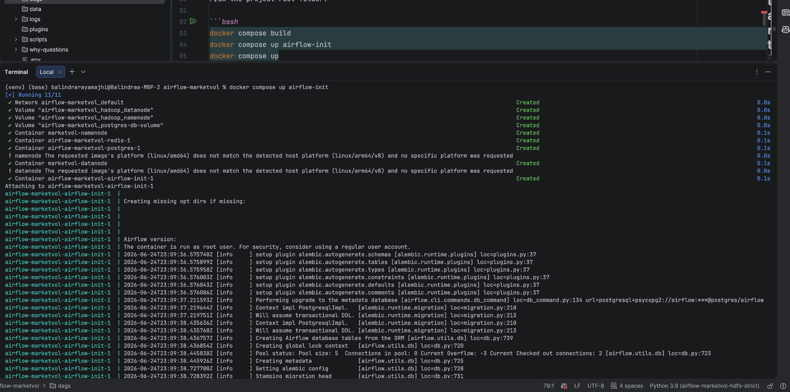

---

## 3. Start All Services

Start the full Docker Compose environment.

```bash
docker compose up
```

This starts Airflow, PostgreSQL, Redis, Hadoop NameNode, Hadoop DataNode, scheduler, worker, triggerer, and DAG processor services.

**Evidence**

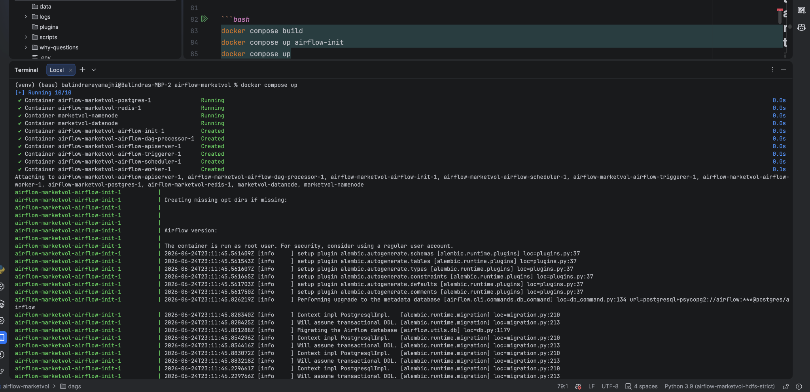

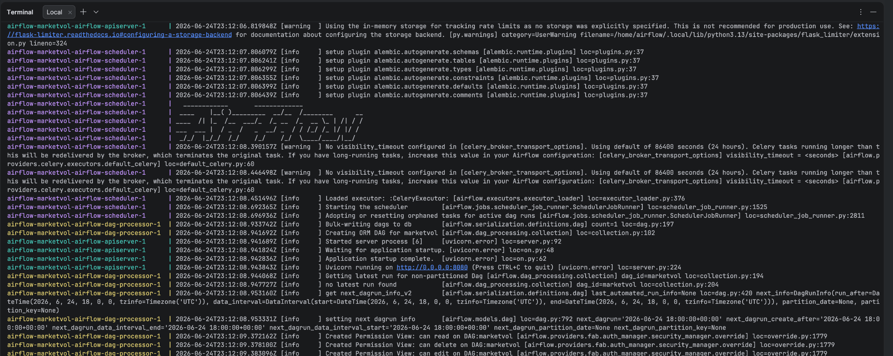

---

## 4. Verify the `marketvol` DAG in Airflow UI

After the services are running, open the Airflow UI and verify that the `marketvol` DAG is visible.

**Expected Result**

- The `marketvol` DAG is listed in the Airflow UI.
- The DAG is available for manual or scheduled execution.

**Evidence**

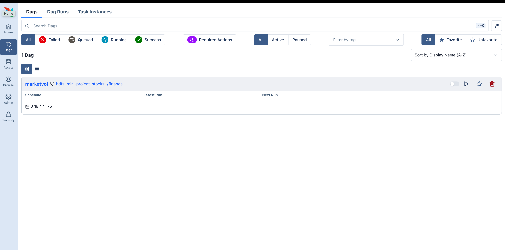

---

## 5. Trigger the `marketvol` DAG Manually

Trigger the DAG manually using the Airflow CLI inside the `airflow-apiserver` container.

```bash
docker compose exec airflow-apiserver airflow dags trigger marketvol
```

**Expected Result**

A new manual DAG run is created and queued.

**Evidence**

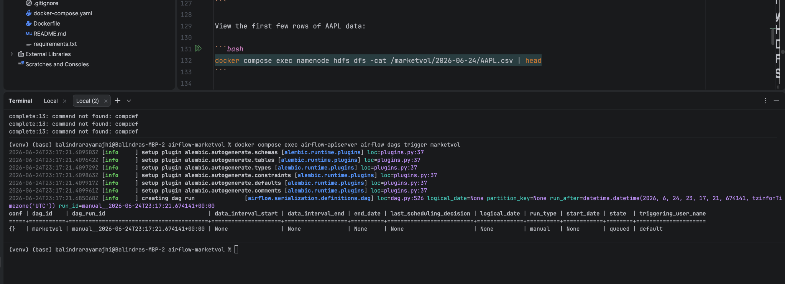

---

## 6. Verify Successful DAG Run in Airflow UI

Open the DAG run in the Airflow UI and verify that all tasks completed successfully.

**Expected Result**

- DAG run status is `Success`.
- All task instances are green.
- No failed tasks are shown.

**Evidence**

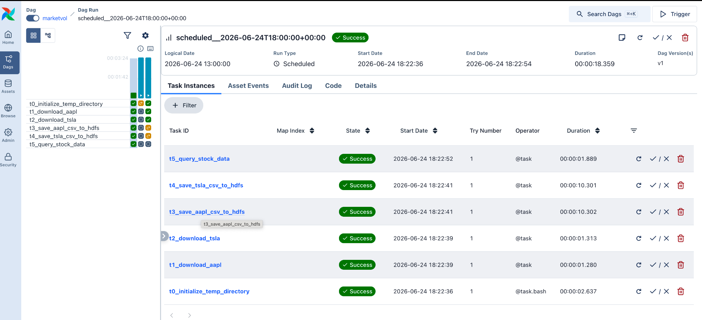

---

## 7. Validate Files Persisted to HDFS

Use the Hadoop NameNode container to list files written under `/marketvol`.

```bash
docker compose exec namenode hdfs dfs -ls -R /marketvol
```

**Expected Files**

- `AAPL.csv`
- `TSLA.csv`
- `marketvol_summary.csv`

**Evidence**

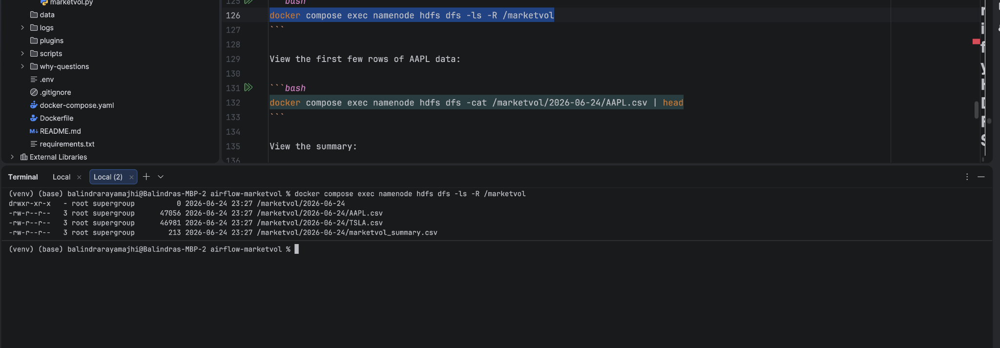

---

## 8. View the Summary File from HDFS

Read the generated summary CSV directly from HDFS.

```bash
docker compose exec namenode hdfs dfs -cat /marketvol/2026-06-24/marketvol_summary.csv
```

**Expected Result**

The summary file should show aggregated stock metrics for AAPL and TSLA.

**Evidence**

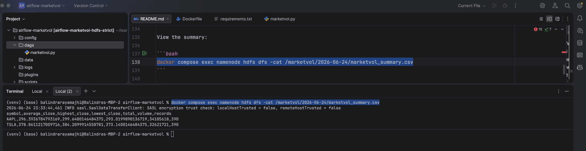

---

## 9. Validate HDFS Files Using Hadoop UI

Open the Hadoop NameNode UI and browse to:

```text
/marketvol/2026-06-24/
```

Verify that the generated files are visible from the Hadoop web interface.

### AAPL CSV File

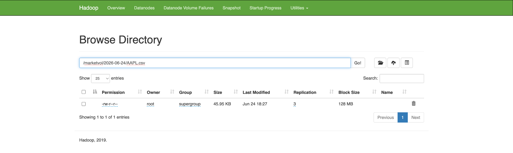

### TSLA CSV File

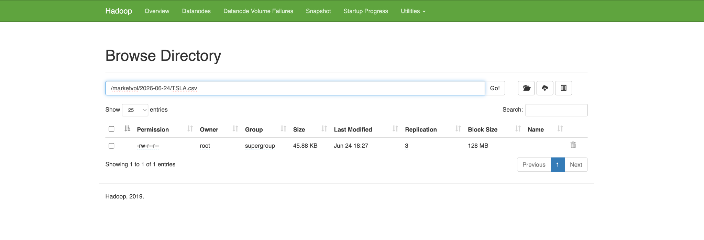

### MarketVol Summary CSV File

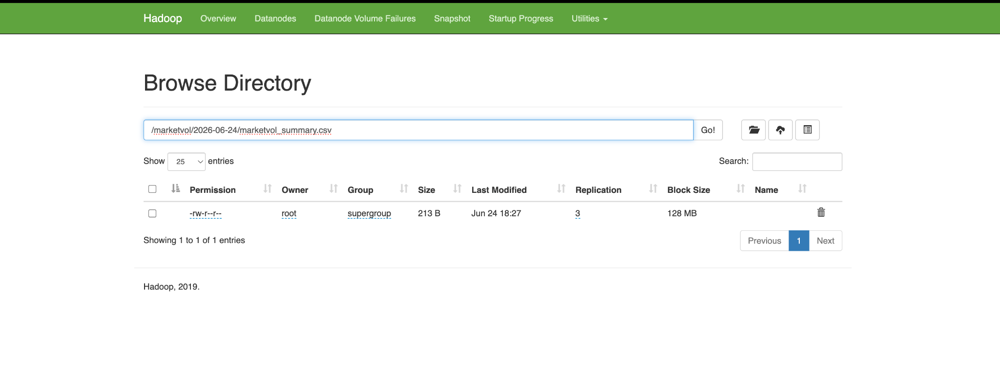

---

## Final Validation Summary

The MarketVol pipeline was successfully validated.

- Docker images built successfully.
- Airflow initialized successfully.
- All Docker Compose services started successfully.
- The `marketvol` DAG appeared in the Airflow UI.
- The DAG was triggered manually from the command line.
- The DAG run completed successfully.
- AAPL, TSLA, and summary files were persisted to HDFS.
- The HDFS output was validated using both CLI commands and the Hadoop UI.
