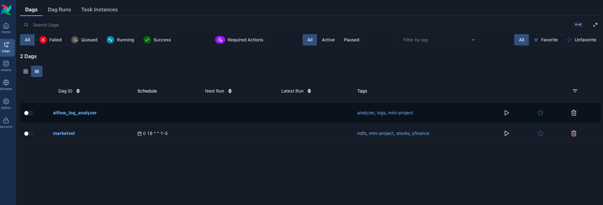
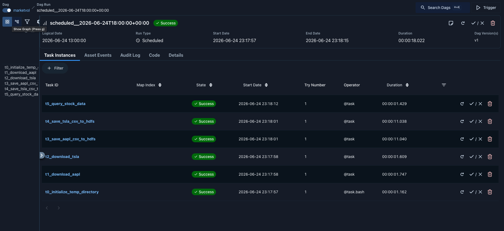
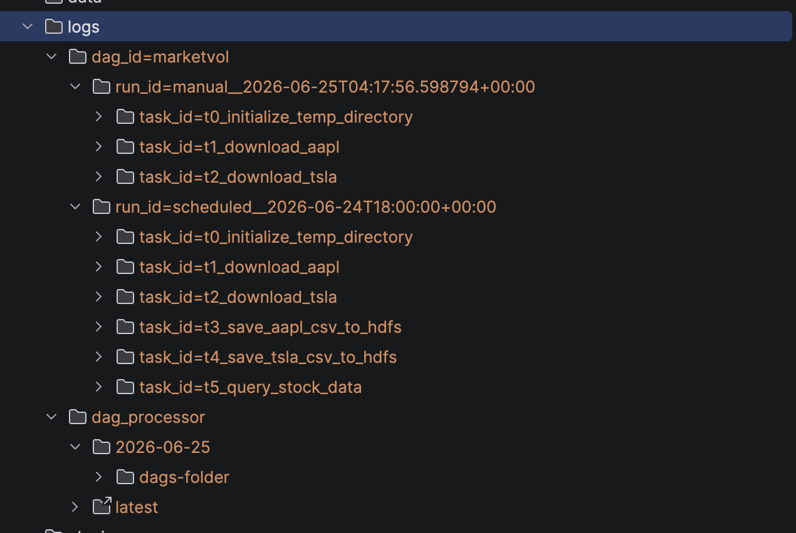
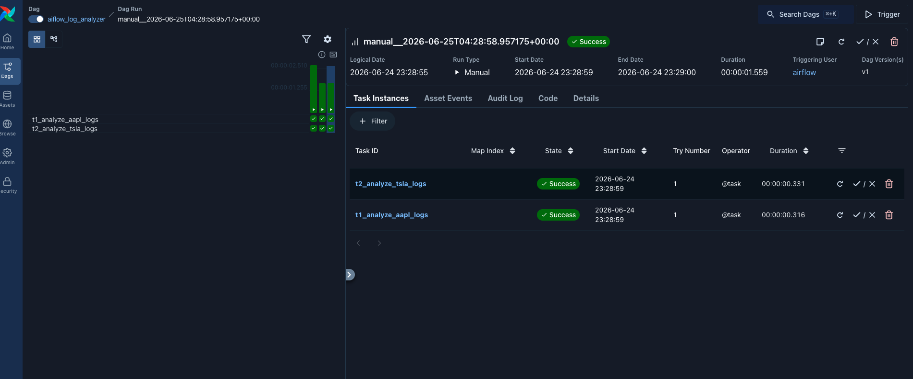
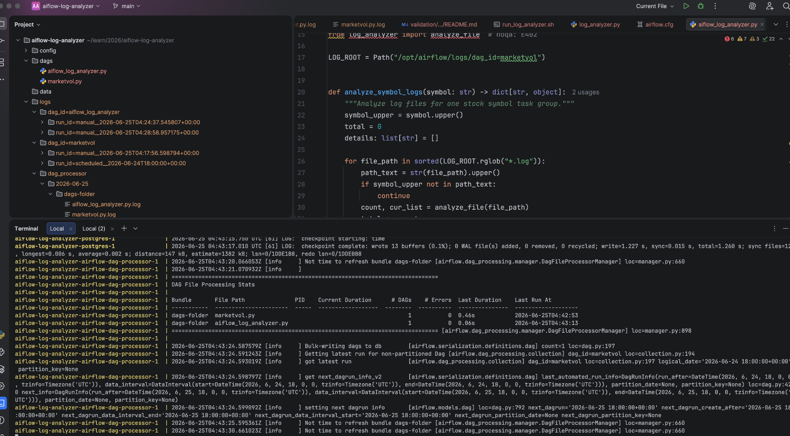

# Airflow Log Analyzer - Execution Validation

This folder contains the execution evidence for validating the **Airflow Log Analyzer** mini-project.

## 1. Verify that `airflow_log_analyzer` is created in the Airflow UI

Confirm that the DAG is successfully loaded and displayed in the Airflow UI.



---

## 2. Verify that the `marketvol` DAG has run successfully and generated log files

Run the `marketvol` DAG first because the log analyzer depends on the generated Airflow task logs.

### Successful DAG Run



### Generated Log Files



---

## 3. Trigger the Airflow Log Analyzer DAG

Execute the following commands:

```bash
docker compose exec airflow-apiserver airflow dags trigger airflow_log_analyzer
docker compose exec airflow-scheduler airflow dags list
```

---

## 4. Confirm that the Airflow Log Analyzer completed successfully

Verify the DAG execution status in the Airflow UI.



---

## 5. Verify the cumulative information collected from all log files

Confirm that the console prints the cumulative number of errors and the detailed error messages discovered while scanning all Airflow log files.



---

## Expected Result

- The `airflow_log_analyzer` DAG is visible in Airflow.
- The `marketvol` DAG completes successfully.
- Airflow log files are generated.
- The Log Analyzer DAG runs successfully.
- The console displays the cumulative log analysis results.
